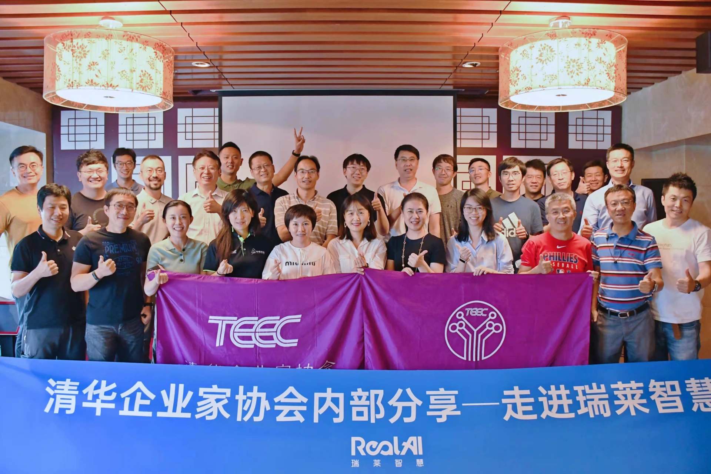
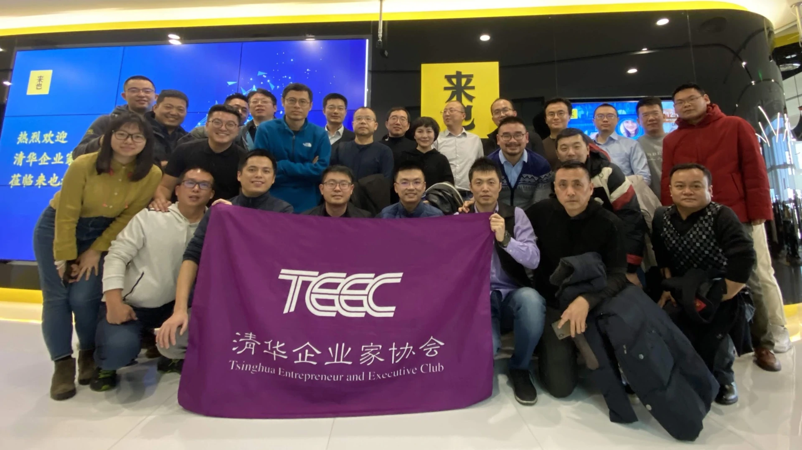

# teec.ml

TEEC AI Club: [清华企业家协会人工智能委员会](https://teec.org.cn/organization/organization-details?id=211)

## TEEC人工智能协会

在刚刚过去的几年中，人工智能技术得到了突飞猛进的发展：

- 2015年，微软亚洲研究院MSRA 在 ImageNet 1000 图像识别任务上超越人类
- 2016年，DeepMind AlphaGo战胜人类棋圣
- 2017年，DeepMind AlphaZero 100-0 完胜AlphaGo
- 2018年，OpenAI 在Dota游戏中，团队作战模式下打败人类世界冠军团队
- 2019年，行业NLP模型在自然语言 GLUE Benchmark 上超越人类平均水准
- 2020年，OpenAI GPT-3语言模型能够独立撰写高可读性文章
- 2021年，Nvidia GauGAN2 神笔马良诞生
- 2022年，TEEC人工智能协会启用AI辅助管理协会工作

然而，大家却又经常觉得人工智能距离自己有些遥远。有人说，AI is Like Teenage SEX:

- Everyone talks about it,
- Nobody really knows how to do it,
- Everyone thinks everyone else is doing it,
- so everyone claims they are doing it.

> &mdash; Dan Ariely, Professor at Duke

TEEC人工智能委员会（TEEC.ML）是由清华企业家协会会员组成的专业委员会，由从事和关心人工智能算法技术前沿，行业应用落地发展的校友组成。协会通过定期组织沙龙活动，管理会员微信群，共享行业资源等方式服务会员。TEEC人工智能协会，将在母校和TTEC总会指导支持下，在会员的积极参与下，用于奉献，开展务实工作，和切实可行的工作，服务好会员企业，在人工智能行业做出清华人的贡献。

欢迎对人工智能领域感兴趣，或者正在从事人工智能行业的会员，加入协会，组织活动，通过协会平台服务同学，讨论价值话题。

## TEEC人工智能委员会微信群成员

向辉，李强，王金林, Jinlin Wang，TEEC秘书处，辛卫民，黄鼎隆，黄竖，罗建刚 清华纽约群，陆凡，王晓东，刘志翔 Jason，Larry，君子不器，王永辉@中金.支柱创投，李立伟，林霆，刘捷@发飚智能，张恺华，乐哈哈，DJ 大江，方元，开云，廖春元，羊志伦，糖果般的微笑，王曙光，王商武，谷春光，邹园斌，陆菁，Wally王英骁，田博，杨军（王茅集团，加持），胡永东 TEEC，陈榕@TEEC，李立国，张聿 Tony Zhang，杨忆风，王胤@孕橙，徐捷，李继凯，徐洪军，段渠，周东Tony，Sue | Amino Capital |丰元资本，Huan (李卓桓)，肖洪波，刘劼，张建伟，RoyKong，红色设计师-Zjr，姜晓丹，刘晓松!，季广云，李竹@英诺，泉生，Ming 李明.映翰通，周文，杨清华，查扬 金杜，李峻 TEEC，Richard刘友忠，郭娜@思源，张立群Frank，姚志锋-Jeff，孙锦，张磊，刘慧凝，刘磊，杨鑫，DLG戴龙光，叶鑫，胡一川，黄耀，孙磊，姜昌浩-计算机07，王敬途Ray，衡 量，sun，杜强，李健，向凯，三石，朱晓宁@TEEC@马拉松摄影，石拓，世界上，钱坤，马俊杰，Changle_Lin，haiker，张卓，谢文，俞凯，林建国，赵勇，许亮，汪思佳，xqf，陈星SING，瞿鑫，程方（清控科创），白皓，zssure@thu，王洁瑶Jill，Allen，朱峰@星站，吴浩，Felix_Du，谭丰，路遥冬，武玮，刘屹洲，尚华，Bin，李祎，魏锋²⁰¹⁹，黄峥嵘Bryan，张黎利，Mike (李卓桓)，白弢，张黎利!，杨宇欣Rock，龚南杰，刘晓光，胡小根，王学辉 | 世纪明德&青青部落，JSun，陈炯炯

## TEEC人工智能委员会活动

### 2021-08-26: Real AI，田天，瑞莱智慧创始人&CEO，青创九期

🔥是什么样的技术在国际安全极客大赛 GeekPwn 2020 首届 CAAD 虚假人脸 AI 识别大赛上，以绝对比分优势夺得冠军！

🔥是什么样的技术创新的提出了将人类知识先验和模型正则化引导学习跨域语义空间！

🔥是什么样的技术在在网信办与公安部举办的第二届“中国人工智能·多媒体信息识别技术大赛”中，斩获“创新之星”奖以及深伪检测竞赛A类奖！

- 【时间】8月26日周四 14:30-16:30
- 【地点】清华科技园科技大厦A座
- 【主题】AI深度合成与影视后期制作
- 【分享人】田天（青创9期）@田天
  - 清华大学西贝尔学者称号
  - AI青年科学家联盟“青年AI科学家”
  - 入选福布斯30岁以下精英榜
  - 入选创业邦“30岁以下创业新贵

-----

### 2021-07-08: AI 作曲家，刘晓光，灵动音创始人&CEO，青创八期

北京灵动音科技有限公司是一家致力于人工智能音乐的公司，成立于2018年2月。创始团队来自清华大学，核心技术来自清华大学计算机系智能技术与系统国家重点实验室，清华大学知识产权技术入股公司。

公司主要目标是降低音乐创作和制作门槛，用AI为音乐行业提供新的产品体验，提升效率，建立音乐的ugc工具及社区。

2018年2月获得华控基石基金、音乐人李健个人的数百万元天使轮投资。2020年8月获得腾讯音乐领投、完美世界等跟投的数千万元A轮融资。

灵动音科技是目前国内唯一掌握音乐全链条自动生成能力的AI音乐公司。其中AI编曲功能已落地于全民K歌“换曲风”功能，使用超1.5亿次。

刘晓光：清华大学化学系09级本硕博。YT八期。

-----

### 2020-12-04: 来也科技 RPA + AI，胡一川，来也科技联合创始人&CTO

本次参访活的「来也科技」创办于2015年，由常春藤盟校（Ivy League）机器学习博士团队发起，致力于做人机共生时代具备全球影响力的智能机器人公司。

核心技术涵盖深度学习、强化学习、机器人流程自动化（RPA）、自然语言处理（NLP）、个性化推荐和多轮多模交互等。公司已获得数十项专利和国家高新技术企业认证。

「来也科技」推出的第一款C端陪伴式机器人“小来”，已通过微信服务了近千万个人用户。

2017年，公司面向企业客户推出B端产品—智能对话机器人平台 “吾来”。

2019年，来也科技与奥森科技合并，携手机器人流程自动化平台“UiBot”，进军RPA+AI市场。

6月27日，AI公司「来也科技」宣布完成与RPA创业公司「奥森科技」合并；“新来也”同时宣布完成B+轮3500万美元融资，进入RPA+AI市场；本轮融资由凯辉创新基金领投，老股东中双湖资本和光速中国超份额跟投；合并后的来也科技，汪冠春继续担任董事长兼CEO，原奥森科技CEO李玮任联席CEO兼总裁，原来也CTO胡一川继续任CTO。

RPA正在席卷全球各行各业，从金融到医疗再到零售，多种重复有规律的工作流程正在被代替。RPA+AI的智能的人机协同，又会是什么个玩法呢？

TEEC人工智能委员会将走进T友胡一川的企业，一探究竟，期待您的参与！

【活动详情】
时间：12月4日（周三）10:30-12:00
分享内容：RPA+AI与智能时代的人机协同
分享人：胡一川（来也科技联合创始人和CTO）
地点：北京市海淀区中关村丹棱街3号 中国电子大厦B座1901

-----

## 2020-2021 委员会成员

- [李卓桓](http://teec.org.cn/member/member-detail?id=104)，主任
- [张黎利](http://teec.org.cn/member/member-detail?id=268)，副主任

TEEC行业委员会工作组指示意见

- [孟虎师兄的指示, Nov, 27, 2021](menghu-nov-22-2021.md)