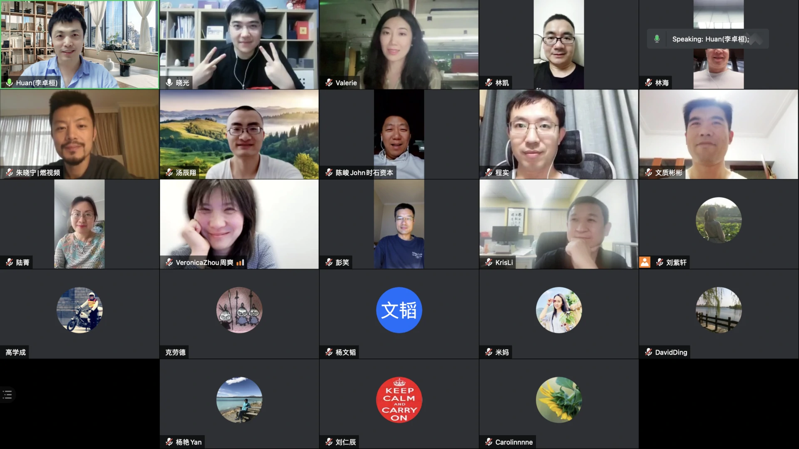

# teec.ml

TEEC AI Club

## Events

TEEC AI Events

### 1. AI 作曲家，刘晓光，Jul 8, 2021

北京灵动音科技有限公司是一家致力于人工智能音乐的公司，成立于2018年2月。创始团队来自清华大学，核心技术来自清华大学计算机系智能技术与系统国家重点实验室，清华大学知识产权技术入股公司。 

公司主要目标是降低音乐创作和制作门槛，用AI为音乐行业提供新的产品体验，提升效率，建立音乐的ugc工具及社区。

2018年2月获得华控基石基金、音乐人李健个人的数百万元天使轮投资。2020年8月获得腾讯音乐领投、完美世界等跟投的数千万元A轮融资。

灵动音科技是目前国内唯一掌握音乐全链条自动生成能力的AI音乐公司。其中AI编曲功能已落地于全民K歌“换曲风”功能，使用超1.5亿次。

刘晓光：清华大学化学系09级本硕博。YT八期。

